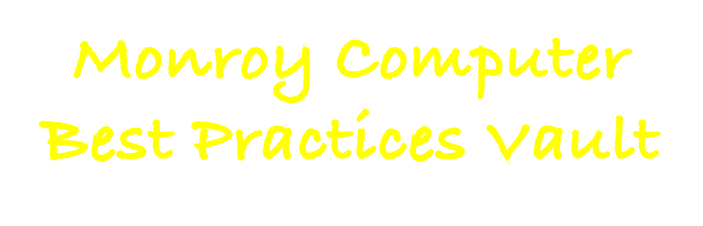

  

# ❓What is Obsidian?
[Obsidian](https://obsidian.md/) is a powerful, free note-taking application with a lot of flexibility and customization options. Also, notes are stored locally!

# 🔐 What is the Monroy Computer Best Practices Vault?
Obsidian notes are organized within vaults, which can be thought of as root folders. Each vault can be uniquely customized to suit different workflows and preferences. The Monroy Computer Best Practices Vault is designed with a few main objectives: 1) to enhance productivity and efficiency with your computer through settings and applications, 2) file management guide, 3) backup guide, 4) encryption guide, and 5) password management guide.

This vault is the result of the process I have undergone to set up my own computer. The result is a guide that's not only highly functional but also practical and cuts through the fluff.

# 🔥 Features
## Productivity Enhancements
- **Productivity Apps and Tools:** Curated list of productivity-enhancing apps and tools, with setup guides and usage tips.
- **Custom Workflows:** Examples of custom workflows using Alfred and other productivity applications.

## Comprehensive File Management System
- **Structured Organization:** Guidance on creating an efficient file structure, including naming conventions and folder hierarchies, to enhance navigability and access.
- **Best Practices for File Storage:** Recommendations for local and cloud storage solutions, balancing convenience with security considerations.

## Encryption and Data Security
- **Encryption Tools and Techniques:** Curated guide on using encryption software to secure sensitive data, both locally and in the cloud.
- **Secure Backup Strategies:** Strategies for creating secure backups, including encrypted backup solutions and best practices for maintaining data privacy.

## Advanced Password Management
- **Selecting Password Managers:** Curated guide of leading password managers, highlighting features, security protocols, and usability.
- **Integration Tips:** How to seamlessly integrate password managers into your digital workflow, including browser extensions and mobile apps.

## Backup and Recovery Solutions
- **Comprehensive Backup Guides:** Instructions on setting up robust local and cloud-based backup systems to protect against data loss.
- **Disaster Recovery Plans:** Step-by-step plans for recovering data in the event of hardware failure, theft, or accidental deletion.

# Installation
- Download and unzip this vault from Github.
- Follow Nicole's [video](https://www.youtube.com/watch?v=OUrOfIqvGS4) for installing Obsidian and opening a vault.

# ✍🏼 Author's Note
Hi, I'm Francisco Monroy, and this vault is a significant part of my transition from pursuing a Ph.D. In preparation for dropping out (in June 2024), I want to set up my computer for peek efficiency and productivity. 

This project is not just a tool I use personally, but also a means to connect with and support others on similar journeys. I hope this vault provides as much value to you as it has to me.

## Connect with Me
- [Twitter, Instagram, TikTok](https://linktr.ee/francisco.mnroy)
- [YouTube Channel](https://www.youtube.com/@Francisco.Monroy) - Join me on my journey! I've recorded over 90% of the process in creating this system while dropping out of my Ph.D. If you're interested in studying along with those videos or understanding my thought process behind this project, be sure to check out my YouTube channel. If you're curious to see whether my journey of dropping out turns into a s^^^show, stay tuned!!
